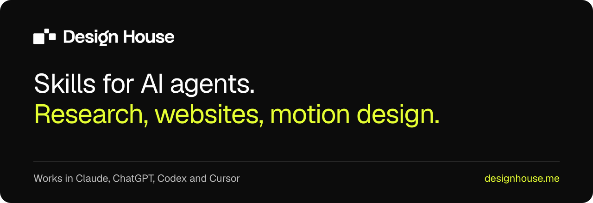

<a href="https://designhouse.me"></a>

# Design House Skills

Skills for AI agents from [Design House](https://designhouse.me). They work in Claude, ChatGPT, Codex, Cursor and other tools that support the [Agent Skills](https://agentskills.io) format.

How we wrote them: [Skills for AI. How to teach Claude and ChatGPT your job](https://designhouse.me/wiedza/skille-dla-ai-jak-pisac) (in Polish).

## Installation

```bash
npx skills add designhouseme/AdvancedSkills
```

Manually:

```bash
git clone https://github.com/designhouseme/AdvancedSkills.git
mkdir -p ~/.claude/skills
cp -r AdvancedSkills/skills/* ~/.claude/skills/
```

In Codex and Cursor, use `~/.agents/skills` instead of `~/.claude/skills`.

## Skills

- `company-research` - research on a specific company, every fact with a source and a date
- `business-website` - takes you from a company description to a finished website
- `website-plan` - the site's section plan and copy
- `website-build` - codes the site from the plan
- `website-review` - a review of the finished site
- `ui-without-slop` - removes the typical decorations of sites made by AI and replaces reflex fonts, Lucide icons and stock shadcn components with decisions
- `motion-design` - motion design videos from code: showreel, product promo, logo intro, 9:16 reels; a render to MP4, a version small enough to send and an animated WebP for a README

Tests are in the `evals/` folder.

## License

[CC BY 4.0](LICENSE). When you use them, credit the author: Design House, https://github.com/designhouseme/AdvancedSkills.

Exceptions: the Urbanist font in `skills/motion-design/assets/fonts/` is under the SIL Open Font License 1.1 (`OFL.txt` next to it), and the license doesn't cover the Design House name, mark and logo.

<br>

<p align="center">
  <a href="https://designhouse.me">
    <picture>
      <source media="(prefers-color-scheme: dark)" srcset=".github/logo-white.svg">
      
    </picture>
  </a>
</p>
